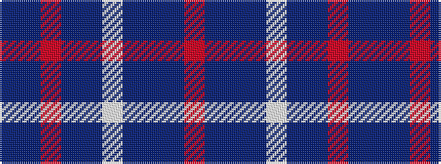

BBRBBWBBBR

It is a 10 stripe tartan.

<figure class="pat-woven">

<figcaption>idealised sample</figcaption>
</figure>

## Colour Sequence



## Tartans with this colour sequence

| Tartans |
|---------------|
| [Marshall](/setts/s10/r4n4dt2n24lb1dt14n2r18n4dt3~x4/)|
||
