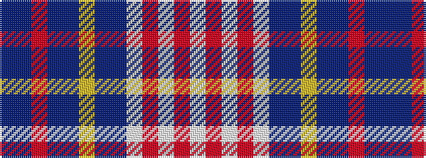

BBRBBYBBWRWRW

It is a 13 stripe tartan.

<figure class="pat-woven">

<figcaption>idealised sample</figcaption>
</figure>

## Colour Sequence



## Tartans with this colour sequence

| Tartans |
|---------------|
| [Unidentified, Gordon variant](/setts/s13/dr4db2oi8db8dbi9lo2dbi9db8w4o4w12o2w4~x2/)|
||
