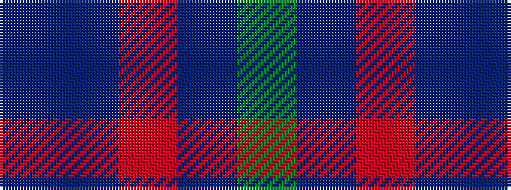

BBRBG

It is a 5 stripe tartan.

<figure class="pat-woven">

<figcaption>idealised sample</figcaption>
</figure>

## Colour Sequence



## Tartans with this colour sequence

| Tartans |
|---------------|
| [Currens (2016)](/setts/s5/dg27n20r9db16b20~x2/)|
||
