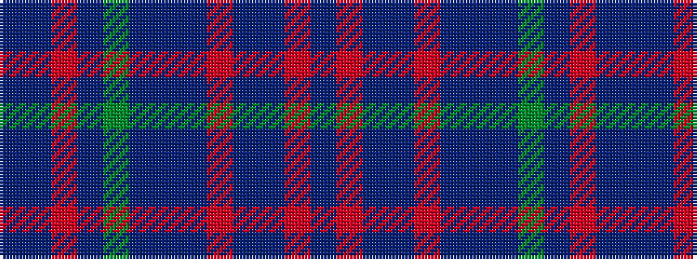

BBRBGBBBRBBRB

It is a 13 stripe tartan.

<figure class="pat-woven">

<figcaption>idealised sample</figcaption>
</figure>

## Colour Sequence



## Tartans with this colour sequence

| Tartans |
|---------------|
| [Bermuda Blue](/variants/s13/b12r4db4b42r6b6db11b6dg19b8r4b6db6/)|
||
| [Bermuda Blue (1962) (District)](/variants/s13/b12r4db4b42r6b6db11b6g19b8r4b6db6/)|
||
