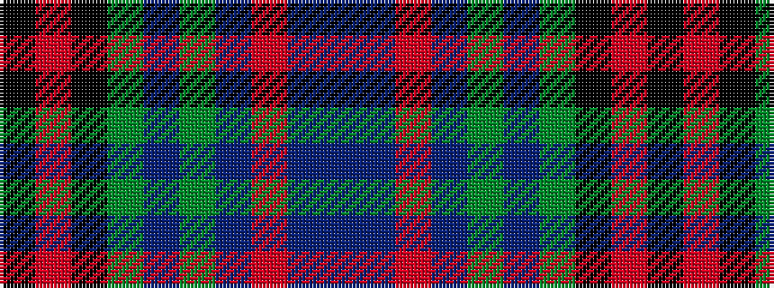

BBRBGBGKRK

It is a 10 stripe tartan.

<figure class="pat-woven">

<figcaption>idealised sample</figcaption>
</figure>

## Colour Sequence



## Tartans with this colour sequence

| Tartans |
|---------------|
| [Dalgliesh, Ewen (Personal)](/setts/s10/db45dp6o6dp30dg6dp6dg30k4r4k3/)|
||
