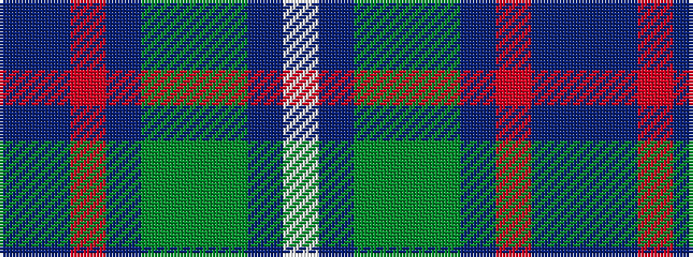

BBRBGGGBW

It is a 9 stripe tartan.

<figure class="pat-woven">

<figcaption>idealised sample</figcaption>
</figure>

## Colour Sequence



## Tartans with this colour sequence

| Tartans |
|---------------|
| [Royal Columbian](/variants/s9/db25t25r2t25g25y2g25db25w4~x2/)|
||
