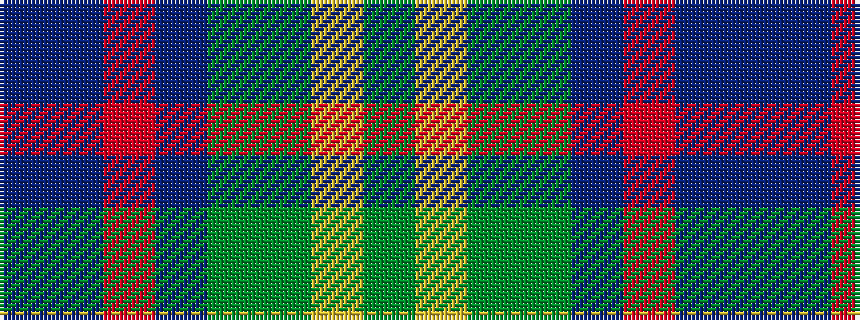

BBRBGGYG

It is a 8 stripe tartan.

<figure class="pat-woven">

<figcaption>idealised sample</figcaption>
</figure>

## Colour Sequence



## Tartans with this colour sequence

| Tartans |
|---------------|
| [Telfer Green](/setts/s8/g7lo2g5dg37db6r16db5b2~x2/)|
||
