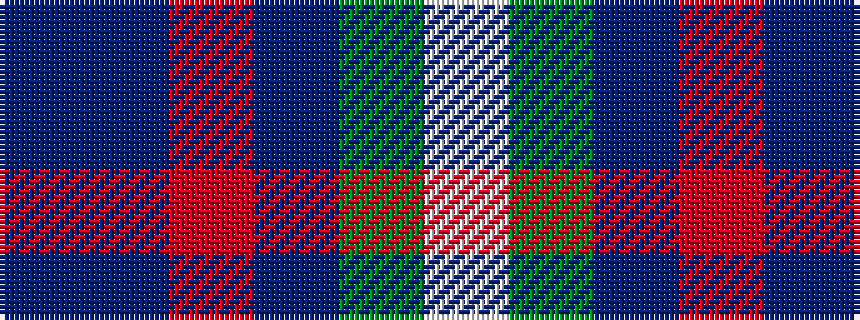

BBRBGW

It is a 6 stripe tartan.

<figure class="pat-woven">

<figcaption>idealised sample</figcaption>
</figure>

## Colour Sequence



## Tartans with this colour sequence

| Tartans |
|---------------|
| [American Express](/setts/s6/db2b9r1db5g5lb2~x4/)|
||
| [American Express](/setts/s6/db2b9m1db9dg9w2~x4/)|
||
