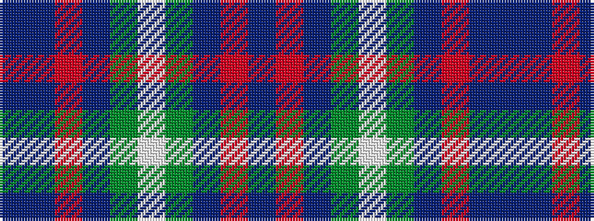

BBRBGWGBRB

It is a 10 stripe tartan.

<figure class="pat-woven">

<figcaption>idealised sample</figcaption>
</figure>

## Colour Sequence



## Tartans with this colour sequence

| Tartans |
|---------------|
| [American Express Corporate Tartan Tartan Number: 2354. Earliest known date: April 1997 American Express began operating in Glasgow in 1903 and in 1920 acquired WA Williamson Ltd of Glasgow. This tartan (commissioned by VP Donald Daly) was designed for the 1997 American Association of Travel Agents conference in Glasgow and based on the MacWilliam tartan. For more details see archives. See products available Copyright © Blair Urquhart, Comrie, 2015](/setts/s10/b9r1db5g5lb2g5db5r1b9db2~x4/)|
||
