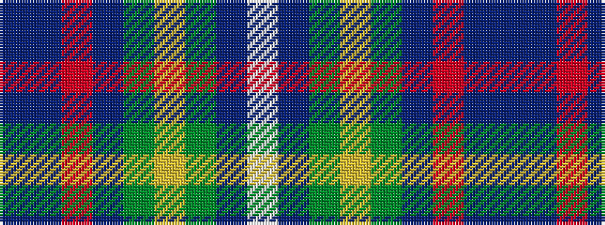

BBRBGYGBW

It is a 9 stripe tartan.

<figure class="pat-woven">

<figcaption>idealised sample</figcaption>
</figure>

## Colour Sequence



## Tartans with this colour sequence

| Tartans |
|---------------|
| [Royal Columbian](/setts/s9/b13t13r1t13g13ly1g13b13w1~x4/)|
||
