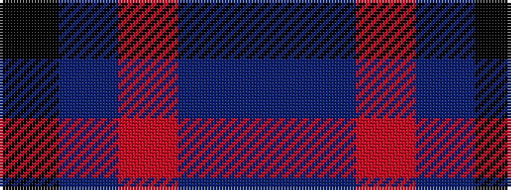

BBRBK

It is a 5 stripe tartan.

<figure class="pat-woven">

<figcaption>idealised sample</figcaption>
</figure>

## Colour Sequence



## Tartans with this colour sequence

| Tartans |
|---------------|
| [O2 (Corporate)](/variants/s5/k15db2r15b6bi1~x2/)|
||
