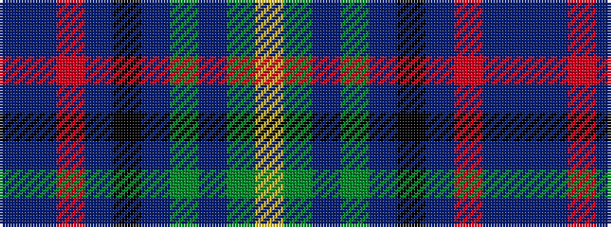

BBRBKBGBGY

It is a 10 stripe tartan.

<figure class="pat-woven">

<figcaption>idealised sample</figcaption>
</figure>

## Colour Sequence



## Tartans with this colour sequence

| Tartans |
|---------------|
| [Boyle (Personal)](/setts/s10/db4db3r2db26k3db3g3db3g17lo3~x2/)|
||
