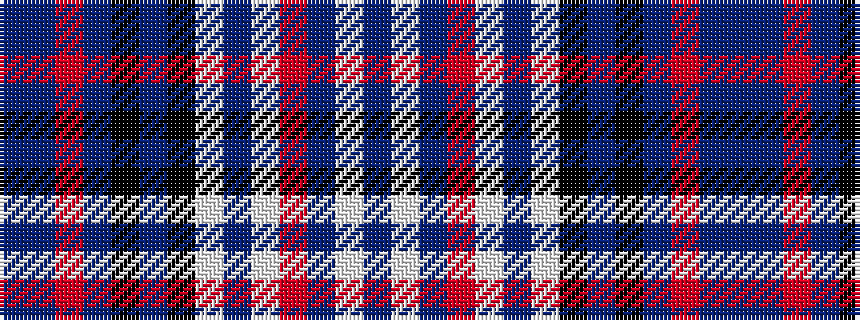

BBRBKBKWBWRBWB

It is a 14 stripe tartan.

<figure class="pat-woven">

<figcaption>idealised sample</figcaption>
</figure>

## Colour Sequence



## Tartans with this colour sequence

| Tartans |
|---------------|
| [Orkney Heather](/setts/s14/db4lp2db2m4lp2db8lp2k2n43k2n43m2db8n2/)|
||
