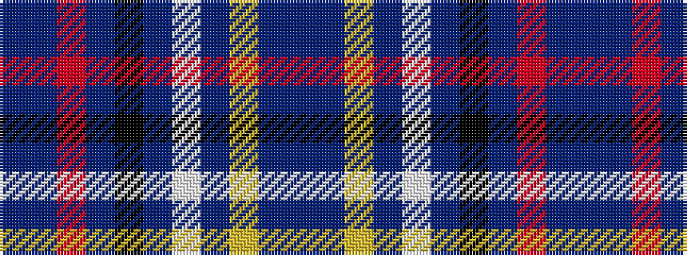

BBRBKBWBYBB

It is a 11 stripe tartan.

<figure class="pat-woven">

<figcaption>idealised sample</figcaption>
</figure>

## Colour Sequence



## Tartans with this colour sequence

| Tartans |
|---------------|
| [Manchester City Football Club "Blue](/setts/s11/db4b13r2db2k2db2w5db2ly2db2b2~x2/)|
||
