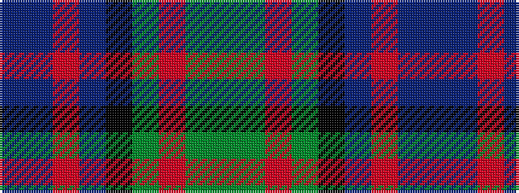

BBRBKGRGG

It is a 9 stripe tartan.

<figure class="pat-woven">

<figcaption>idealised sample</figcaption>
</figure>

## Colour Sequence



## Tartans with this colour sequence

| Tartans |
|---------------|
| [MacThomas](/variants/s9/dg1dg1r2dg21k11db21r2db1db1~x2/)|
||
