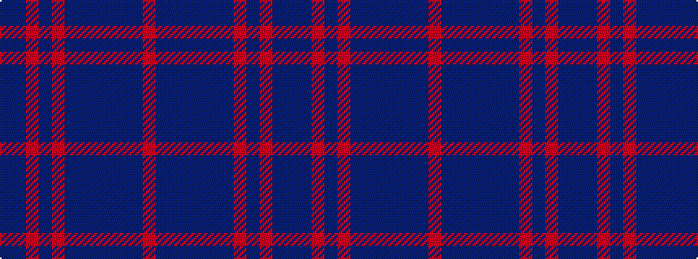

BBRBRBBBBBBR

It is a 12 stripe tartan.

<figure class="pat-woven">

<figcaption>idealised sample</figcaption>
</figure>

## Colour Sequence



## Tartans with this colour sequence

| Tartans |
|---------------|
| [Thomas Blake Glover](/variants/s12/db4dr16o6dr16o6dr16db8dr6db4dr16db2o1~x2/)|
||
