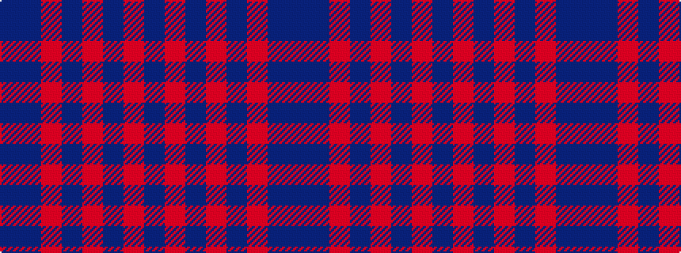

BBRBRBRB

It is a 8 stripe tartan.

<figure class="pat-woven">

<figcaption>idealised sample</figcaption>
</figure>

## Colour Sequence



## Tartans with this colour sequence

| Tartans |
|---------------|
| [Rikaco Vintage](/variants/s8/dt74m9dt4r5dt4m9dt37db9~x2/)|
||
