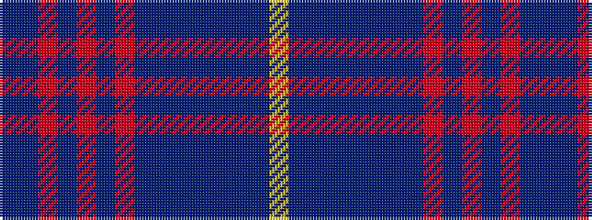

BBRBRBRBBBBBBBY

It is a 15 stripe tartan.

<figure class="pat-woven">

<figcaption>idealised sample</figcaption>
</figure>

## Colour Sequence



## Tartans with this colour sequence

| Tartans |
|---------------|
| [Scottish-Shop Switzerland](/setts/s15/dp4dt1o15dt2o2dt2o2dt12dp2dt2dp2dt2dp14dt1ly4~x2/)|
||
