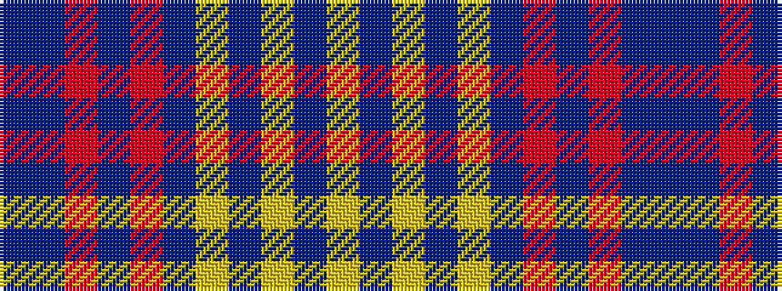

BBRBRBYBYBY

It is a 11 stripe tartan.

<figure class="pat-woven">

<figcaption>idealised sample</figcaption>
</figure>

## Colour Sequence



## Tartans with this colour sequence

| Tartans |
|---------------|
| [Rourke-Frew (Ontario)](/setts/s11/dp6do3r2do3r31do6lo2do6lo13do2lo2~x2/)|
||
