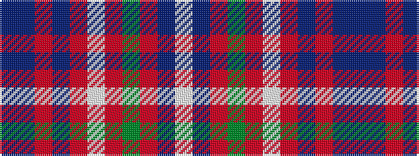

BBRBRWRGRBW

It is a 11 stripe tartan.

<figure class="pat-woven">

<figcaption>idealised sample</figcaption>
</figure>

## Colour Sequence



## Tartans with this colour sequence

| Tartans |
|---------------|
| [MacDonald of Glenaladale](/setts/s11/db3t1r30db32r3w1r3g23r31db3w1/)|
||
| [MacDonald of Glenaladale](/setts/s11/db3t1r30db32r3w1r3dg23r31db3w1/)|
||
