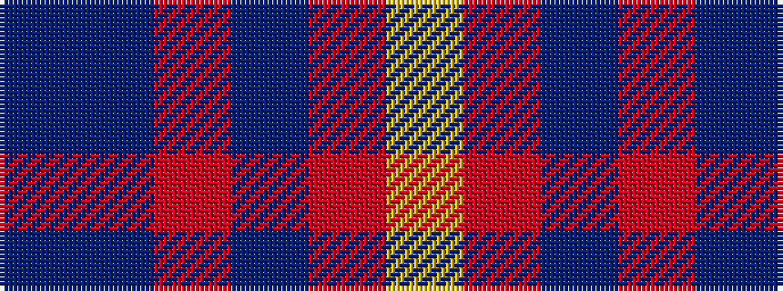

BBRBRY

It is a 6 stripe tartan.

<figure class="pat-woven">

<figcaption>idealised sample</figcaption>
</figure>

## Colour Sequence



## Tartans with this colour sequence

| Tartans |
|---------------|
| [Lytley Formal (Personal)](/setts/s6/db1dt1r1dp2r1ly1~x10/)|
||
| [Lytley alias Parsons Formal (Personal)](/setts/s6/db1db1r1p2r1ly1~x10/)|
||
