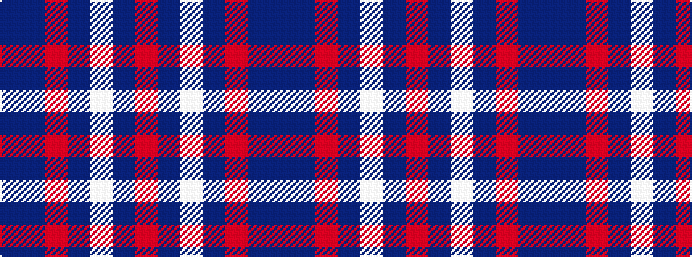

BBRBWBR

It is a 7 stripe tartan.

<figure class="pat-woven">

<figcaption>idealised sample</figcaption>
</figure>

## Colour Sequence



## Tartans with this colour sequence

| Tartans |
|---------------|
| [British American School (Corporate)](/variants/s7/db2b2r1b16w1db20r2~x2/)|
||
