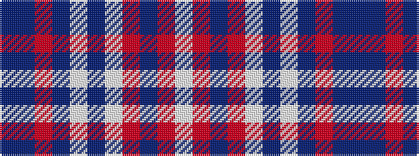

BBRBWBWRBRW

It is a 11 stripe tartan.

<figure class="pat-woven">

<figcaption>idealised sample</figcaption>
</figure>

## Colour Sequence



## Tartans with this colour sequence

| Tartans |
|---------------|
| [Mingulay (Fashion)](/setts/s11/db45n5o1dt1lb1dt1lb5o3dt1o2lb1~x4/)|
||
