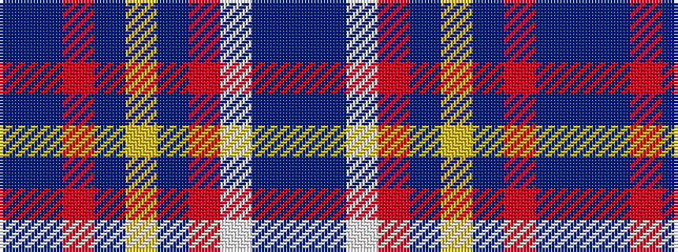

BBRBYBRWBB

It is a 10 stripe tartan.

<figure class="pat-woven">

<figcaption>idealised sample</figcaption>
</figure>

## Colour Sequence



## Tartans with this colour sequence

| Tartans |
|---------------|
| [Union Memorial Tartan](/variants/s10/t12t4r4t4ly2db56r18lb1db4db3~x2/)|
||
