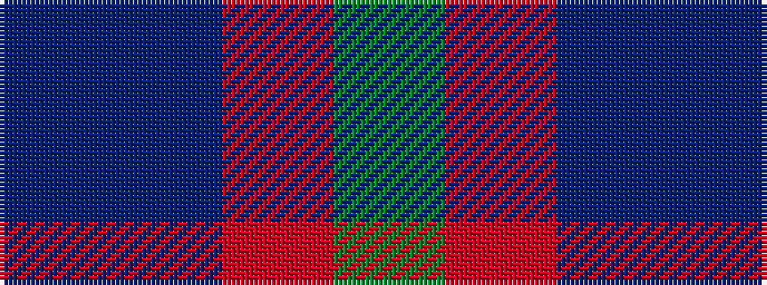

BBRG

It is a 4 stripe tartan.

<figure class="pat-woven">

<figcaption>idealised sample</figcaption>
</figure>

## Colour Sequence



## Tartans with this colour sequence

| Tartans |
|---------------|
| [Jodi Williams (Personal)](/variants/s4/g8r1db1n1~x10/)|
||
| [MacNab](/variants/s4/dg15r3db11t2~x2/)|
||
| [MacNab 7](/variants/s4/g15r3p11t2~x2/)|
||
| [MacNab WI2](/setts/dg15r3n11b2/)|
||
| [Unidentified #4](/variants/s4/dg14r3db9t2~x2/)|
||
| [Unidentified 10](/variants/s4/g14r3db9t2~x2/)|
||
