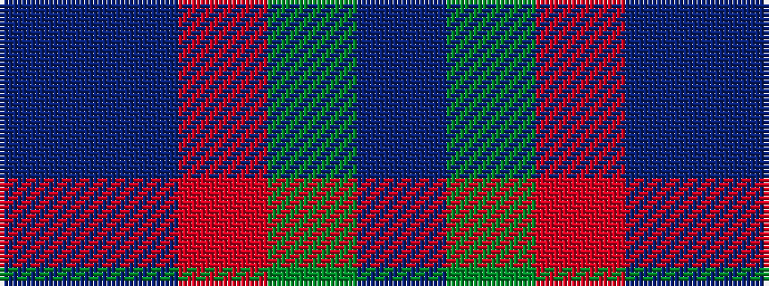

BBRGB

It is a 5 stripe tartan.

<figure class="pat-woven">

<figcaption>idealised sample</figcaption>
</figure>

## Colour Sequence



## Tartans with this colour sequence

| Tartans |
|---------------|
| [Wilson's No.95](/setts/s5/t1dg3r1dp3t1~x4/)|
||
| [Wilson's, No 95](/setts/s5/t1g3r1p3t1~x4/)|
||
