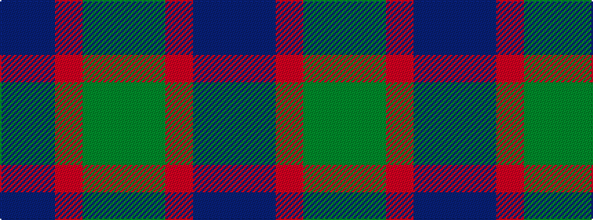

BBRGG

It is a 5 stripe tartan.

<figure class="pat-woven">

<figcaption>idealised sample</figcaption>
</figure>

## Colour Sequence



## Tartans with this colour sequence

| Tartans |
|---------------|
| [Dunanas Rising (Corporate)](/variants/s5/dg35y25r15b2db21~x2/)|
||
| [Dunans Rising](/variants/s5/g35y25m15t2t21~x2/)|
||
