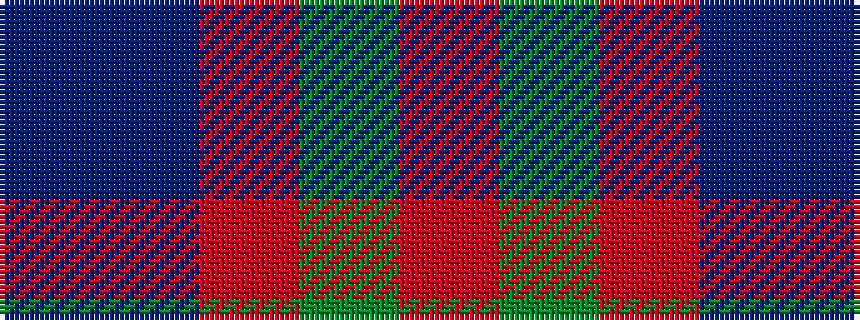

BBRGR

It is a 5 stripe tartan.

<figure class="pat-woven">

<figcaption>idealised sample</figcaption>
</figure>

## Colour Sequence



## Tartans with this colour sequence

| Tartans |
|---------------|
| [Hebridean 4](/variants/s5/r1g7r3db7t1~x2/)|
||
| [Unamed Riding cloak 1745](/variants/s5/r1dy8r2db8t1~x2/)|
||
