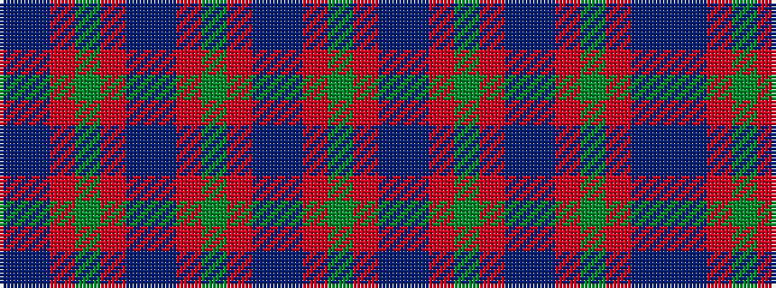

BBRGRBBRGRBBRG

It is a 14 stripe tartan.

<figure class="pat-woven">

<figcaption>idealised sample</figcaption>
</figure>

## Colour Sequence



## Tartans with this colour sequence

| Tartans |
|---------------|
| [Glen Orchy](/variants/s14/db2t1r2g16r2db6t1r2g6r2db16t1r2g2~x2/)|
||
| [Glenorchy](/variants/s14/dg2r2t1db16r2dg6r2t1db6r2dg16r2t1db2~x2/)|
||
