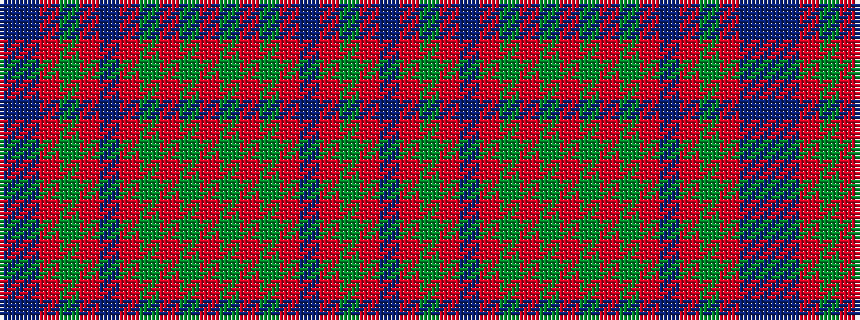

BBRGRBRGRGRGRGRBRGRB

It is a 20 stripe tartan.

<figure class="pat-woven">

<figcaption>idealised sample</figcaption>
</figure>

## Colour Sequence



## Tartans with this colour sequence

| Tartans |
|---------------|
| [Hebrides #2](/setts/s20/db25db2r25g10r4db25r2g2r25g2r2~x2/)|
||
