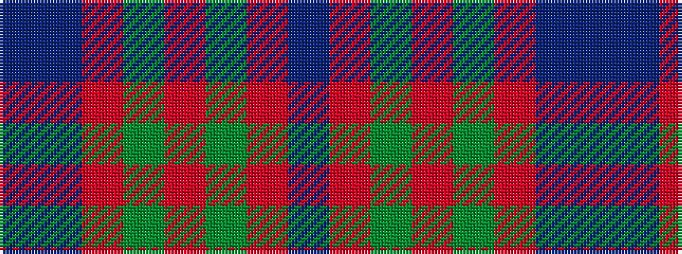

BBRGRGRB

It is a 8 stripe tartan.

<figure class="pat-woven">

<figcaption>idealised sample</figcaption>
</figure>

## Colour Sequence



## Tartans with this colour sequence

| Tartans |
|---------------|
| [Hebrides #8](/variants/s8/db7r3g7r1g7r3db7t1~x2/)|
||
