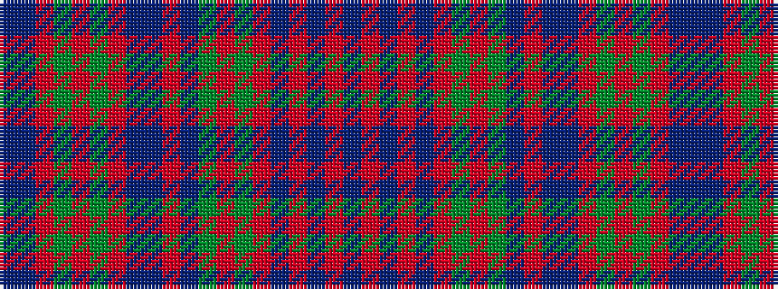

BBRGRGRBBRBGRGRBRBRB

It is a 20 stripe tartan.

<figure class="pat-woven">

<figcaption>idealised sample</figcaption>
</figure>

## Colour Sequence



## Tartans with this colour sequence

| Tartans |
|---------------|
| [MacDougall](/setts/s20/b2dr12r4dg72r8dg4r8db18dr12r4dr12dg18r18dg18r8db4r72dr6r4b1~x2/)|
||
