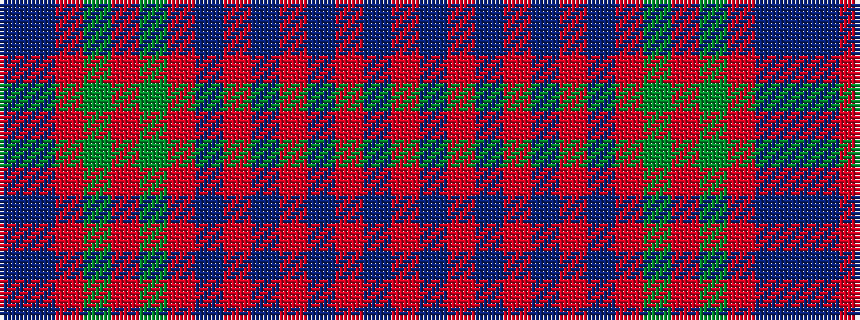

BBRGRGRBRBRBRBR

It is a 15 stripe tartan.

<figure class="pat-woven">

<figcaption>idealised sample</figcaption>
</figure>

## Colour Sequence



## Tartans with this colour sequence

| Tartans |
|---------------|
| [Grant](/variants/s15/db6p2r2g5r2g2r2p6r2t2r24p2r2p2r6~x2/)|
||
| [Grant or New Bruce](/variants/s15/r12p2r4p4r39t2r4p11r6g4r6g45r4p4db10/)|
||
| [Grant or New Bruce Clan Tartan](/variants/s15/r12dp2r4dp4r39t2r4dp11r6g4r6g45r4dp4db10/)|
||
