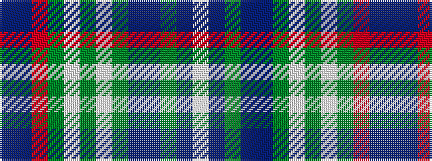

BBRGWGWGBBGBW

It is a 13 stripe tartan.

<figure class="pat-woven">

<figcaption>idealised sample</figcaption>
</figure>

## Colour Sequence



## Tartans with this colour sequence

| Tartans |
|---------------|
| [Leando Dress (Personal)](/setts/s13/b38do4m3dy6w2dy2w2dy2do12b6dy2b6w2~x2/)|
||
