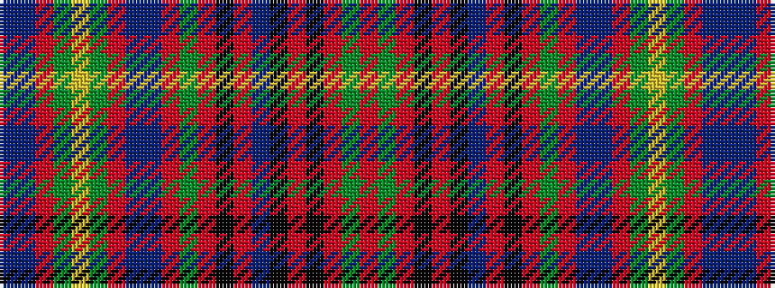

BBRGYGRBBRGRKRBKRKRGR

It is a 21 stripe tartan.

<figure class="pat-woven">

<figcaption>idealised sample</figcaption>
</figure>

## Colour Sequence



## Tartans with this colour sequence

| Tartans |
|---------------|
| [Gordonstoun](/setts/s21/r4g4r1k7r1k1t1r1k7r1g4r4t1db4r1g7ly1g7r1db4t1~x4/)|
||
