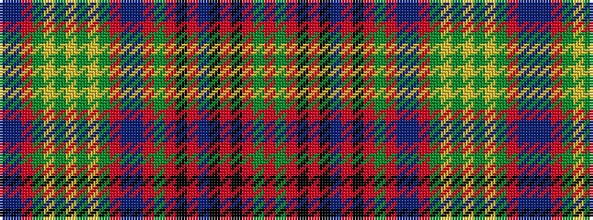

BBRGYGYGYGRBBRGRKRBKRKRGR

It is a 25 stripe tartan.

<figure class="pat-woven">

<figcaption>idealised sample</figcaption>
</figure>

## Colour Sequence



## Tartans with this colour sequence

| Tartans |
|---------------|
| [Gordonstoun](/variants/s25/r8g8r2k14r2k2t2r2k14r2g8r8t2db8r2g14ly2g2ly3g2ly2g14r2db8t2~x2/)|
||
| [Gordonstoun (1957)](/variants/s25/r8dg8r2k14r2k2t2r2k14r2dg8r8t2db8r2dg14ly2dg2ly3dg2ly2dg14r2db8t2~x2/)|
||
