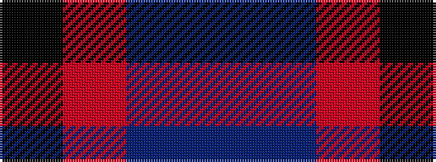

BBRK

It is a 4 stripe tartan.

<figure class="pat-woven">

<figcaption>idealised sample</figcaption>
</figure>

## Colour Sequence



## Tartans with this colour sequence

| Tartans |
|---------------|
| [Alich (Personal)](/setts/s4/k50r1db3dp1~x4/)|
||
| [Alich (Personal)](/setts/s4/k50r1dt3dp1~x4/)|
||
