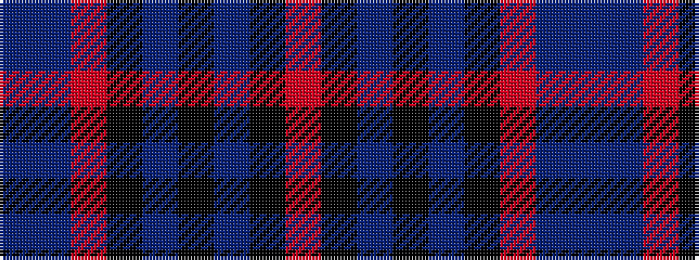

BBRKBKBKR

It is a 9 stripe tartan.

<figure class="pat-woven">

<figcaption>idealised sample</figcaption>
</figure>

## Colour Sequence



## Tartans with this colour sequence

| Tartans |
|---------------|
| [Grassi (Personal)](/setts/s9/dp3n2o2k60n2k3n12k1o3~x2/)|
||
