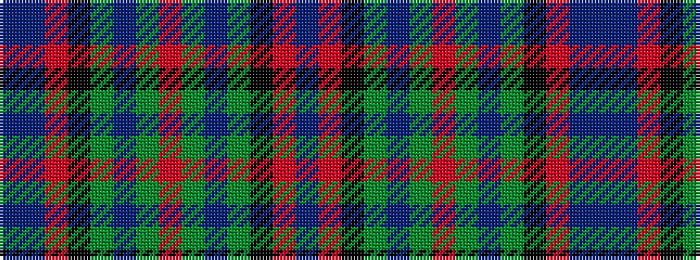

BBRKGBGRGBGKRB

It is a 14 stripe tartan.

<figure class="pat-woven">

<figcaption>idealised sample</figcaption>
</figure>

## Colour Sequence



## Tartans with this colour sequence

| Tartans |
|---------------|
| [Hinnigan (Personal)](/variants/s14/db4o14k14g4db16g4o8g4db16g4k14o14db4b3~x2/)|
||
