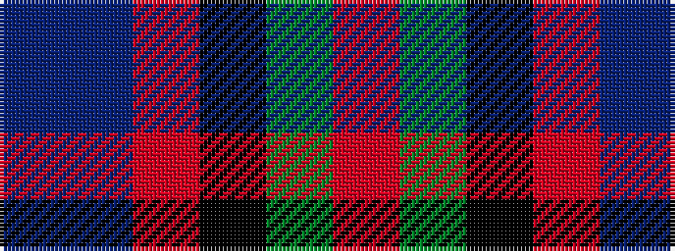

BBRKGR

It is a 6 stripe tartan.

<figure class="pat-woven">

<figcaption>idealised sample</figcaption>
</figure>

## Colour Sequence



## Tartans with this colour sequence

| Tartans |
|---------------|
| [Wilson's No.221](/setts/s6/r1dg14k14r2db14t1~x2/)|
||
| [Wilson's, No 221](/setts/s6/r1g14k14r2db14t1~x2/)|
||
