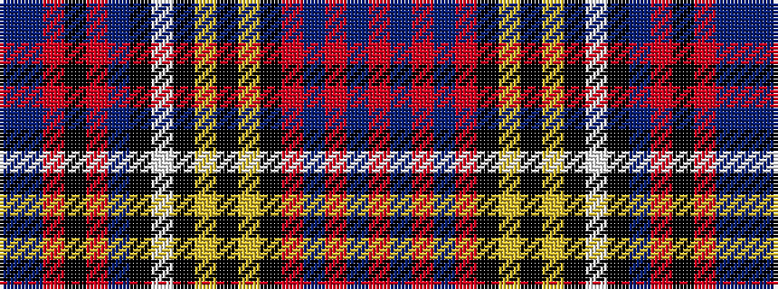

BBRKRBKWKYKYKRBRBR

It is a 18 stripe tartan.

<figure class="pat-woven">

<figcaption>idealised sample</figcaption>
</figure>

## Colour Sequence



## Tartans with this colour sequence

| Tartans |
|---------------|
| [Westwood MacAndreas](/variants/s18/r5b6r2b9r14k5lo2k2lo2k5w5k5t23r1k2r1t5b4~x2/)|
||
