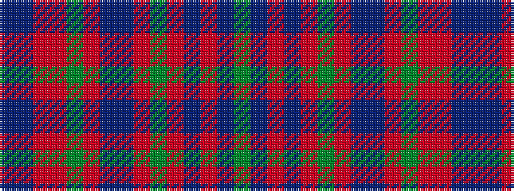

BBRRGRBBRGRBRBG

It is a 15 stripe tartan.

<figure class="pat-woven">

<figcaption>idealised sample</figcaption>
</figure>

## Colour Sequence



## Tartans with this colour sequence

| Tartans |
|---------------|
| [Glenorchy - National Archives](/setts/s15/g3db2ri1db17r2g8r4t1db8r2g17r2ri1db3t1~x2/)|
||
