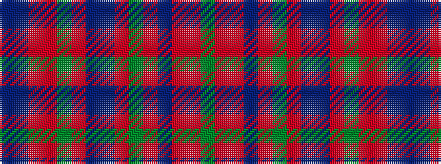

BBRRGRBBRGRBRRG

It is a 15 stripe tartan.

<figure class="pat-woven">

<figcaption>idealised sample</figcaption>
</figure>

## Colour Sequence



## Tartans with this colour sequence

| Tartans |
|---------------|
| [Glen Orchy](/setts/s15/g3ri2r1db18ri2g8ri4t1db8ri2g18ri2r1db3t1~x2/)|
||
