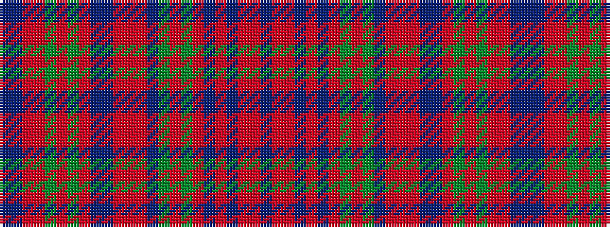

BBRRGRGRBBRRRBGRGRBRBRRB

It is a 24 stripe tartan.

<figure class="pat-woven">

<figcaption>idealised sample</figcaption>
</figure>

## Colour Sequence



## Tartans with this colour sequence

| Tartans |
|---------------|
| [MacDougall of MacDougall](/variants/s24/t2dp10ri3r4dg72r7dg4r10db24dp6ri5r4ri5dp7dg24r24dg24r3db3r74dp7ri5r6t2~x2/)|
||
| [MacDougall, of MacDougall](/variants/s24/t2p10r3ri4g72ri7g4ri10db24p6r5ri4r5p7g24ri24g24ri3db3ri74p7r5ri6t2~x2/)|
||
