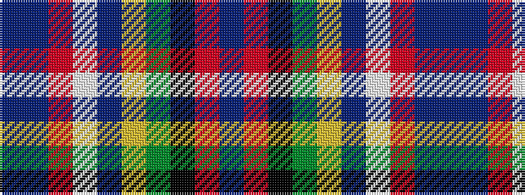

BBRWBYGKRB

It is a 10 stripe tartan.

<figure class="pat-woven">

<figcaption>idealised sample</figcaption>
</figure>

## Colour Sequence



## Tartans with this colour sequence

| Tartans |
|---------------|
| [Yorston (2014)](/setts/s10/db109t12r4w4db5ly4g5k4r4t18/)|
||
