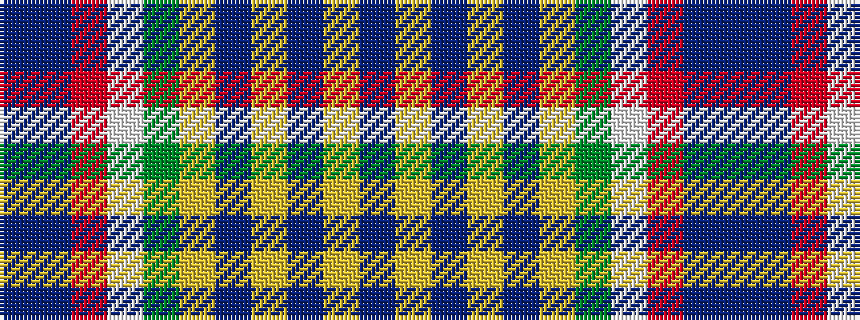

BBRWGYBYBYB

It is a 11 stripe tartan.

<figure class="pat-woven">

<figcaption>idealised sample</figcaption>
</figure>

## Colour Sequence



## Tartans with this colour sequence

| Tartans |
|---------------|
| [Yukon](/variants/s11/t20dp4r4w4g4ly4t4ly1t2ly1t20~x4/)|
||
