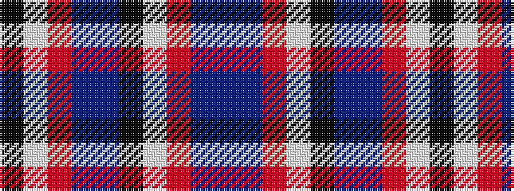

BBRWKBBRWK

It is a 10 stripe tartan.

<figure class="pat-woven">

<figcaption>idealised sample</figcaption>
</figure>

## Colour Sequence



## Tartans with this colour sequence

| Tartans |
|---------------|
| [Le Mirage (Corporate?)](/setts/s10/db36db15r25w5k6db35db15r7w5k6/)|
||
