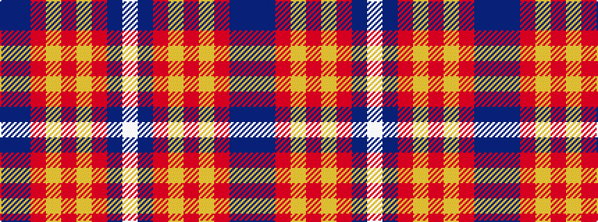

BBRYRYRBW

It is a 9 stripe tartan.

<figure class="pat-woven">

<figcaption>idealised sample</figcaption>
</figure>

## Colour Sequence



## Tartans with this colour sequence

| Tartans |
|---------------|
| [Khosla, Sarah and Justin (Personal)](/variants/s9/dp4n10m18ly3m3ly5r8n9w4~x2/)|
||
