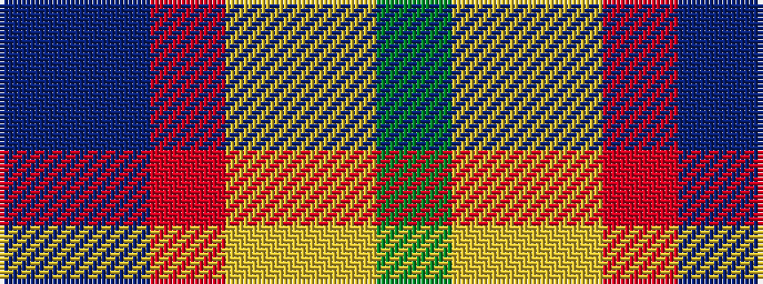

BBRYYG

It is a 6 stripe tartan.

<figure class="pat-woven">

<figcaption>idealised sample</figcaption>
</figure>

## Colour Sequence



## Tartans with this colour sequence

| Tartans |
|---------------|
| [Rainbow](/setts/s6/g2ly1lo1r1p1db1~x36/)|
||
| [Rainbow (Fashion)](/setts/s6/g2ly1lo1r1dp1db1~x36/)|
||
