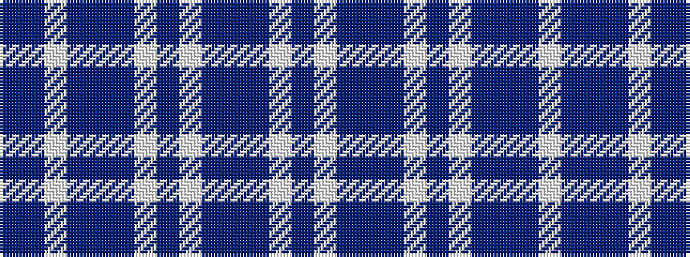

BBWBBBWBWBBBWB

It is a 14 stripe tartan.

<figure class="pat-woven">

<figcaption>idealised sample</figcaption>
</figure>

## Colour Sequence



## Tartans with this colour sequence

| Tartans |
|---------------|
| [Harmony Eildon](/setts/s14/db41t2w2t2db5t12w31db4~x2/)|
||
